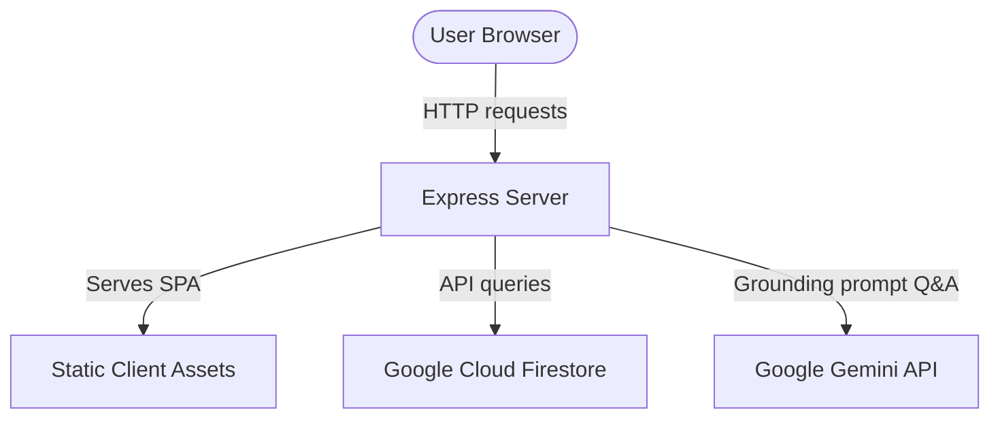

# Architecture Overview — ArenaFlow

This document provides a high-level view of the ArenaFlow application structure, data flow, and key components.



## Directory Structure

```
├── .github/                 # CI/CD Workflows, templates, CODEOWNERS
├── client/                  # React 19 + TypeScript + Vite SPA client
│   ├── src/
│   │   ├── components/      # Common UI (Layouts, status indicators)
│   │   ├── features/        # Feature screens (Assistant, Operations)
│   │   └── lib/             # API clients, offline data stores
│   └── tests/               # Vitest suite for client-side code
├── docs/                    # Architecture decisions and results docs
├── e2e/                     # Playwright E2E and WCAG accessibility tests
├── server/                  # Node 22 + Express 5 API server
│   ├── src/
│   │   ├── config/          # Constant declarations and env validation
│   │   ├── features/        # Feature domains (Assistant, Operations, Stadium)
│   │   ├── lib/             # Upstream SDK connectors, TTL cache, async utils
│   │   └── middleware/      # Rate limits, error boundaries, zod validation
│   └── tests/               # Vitest suite for server-side code
```

## Data and Request Flow

1. **Routing and Boundaries**:
   - The React client uses `react-router-dom` for client-side routing.
   - All network requests funnel through `client/src/lib/api.ts` to ensure consistent error handling.
   - On the backend, requests cross a validation boundary using Zod schemas (`server/src/middleware/validate.ts`) before invoking features.

2. **Operations Live Data**:
   - A Firestore database maintains the live stadium state (`zones`, `incidents`, `sustainability`).
   - A background simulator (`server/src/index.ts`) runs a periodic random walk to simulate turnstile telemetry updates.

3. **Multilingual Fan Assistant**:
   - Accepts fan questions, grounding them in static stadium venue layouts (`server/src/features/stadium/venue-data.ts`).
   - The compiled prompt is sent to Gemini via the official `@google/genai` SDK.
   - Common answers are stored in an in-memory `TtlCache` (ADR-4) to optimize cost and performance.

4. **Offline / Low-Connectivity Fallback**:
   - When network connectivity is lost, the client serves cached operations snapshots and performs client-side Q&A matching on the cached venue layout.
